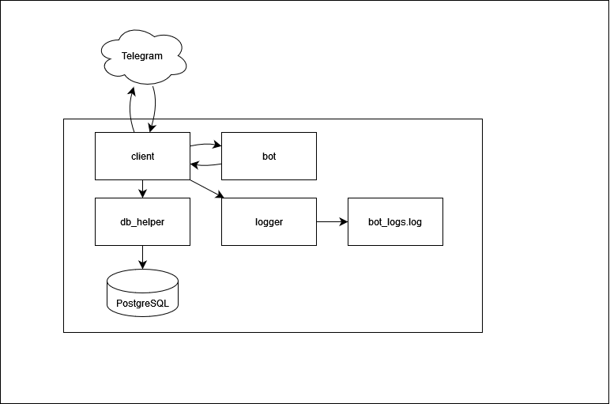

# Telegram bot with generative model

### Description
The bot generates a unique text wish based on the user's request. Communication takes place via a button labeled "Пожелай мне чего-нибудь!"

### Installation
- The program runs on Ubuntu 22.04 operating system.
- Python 3.10.12

1. Make a fork of this repository and clone your fork on your local device.
2. Use venv to create a virutal environment at the root of the local repository. Go to the environment.
3. Use pip to install the required versions of the modules described in the requirements.txt.
4. Run main.py

### Environment
All environment variables are stored in .env. To work with them, use config.py and the settings object.

### Notes
- When trying to run on your device, there may be problems with paths
- To test the web part of the application, you can use ngrok to create a tunnel

### Project scheme

